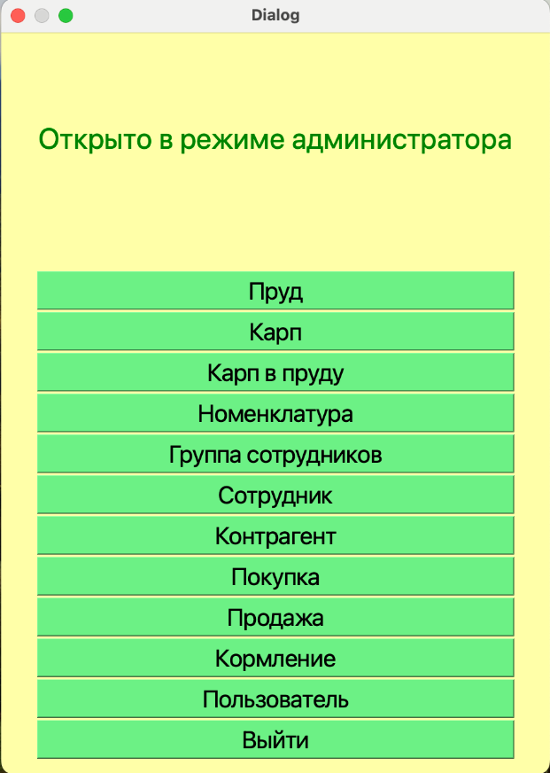
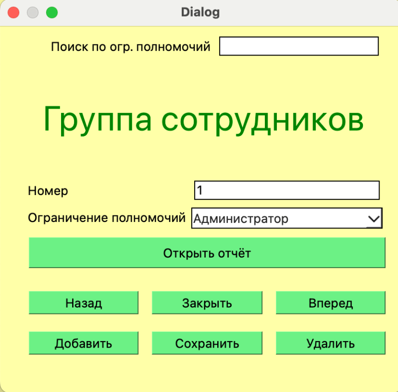
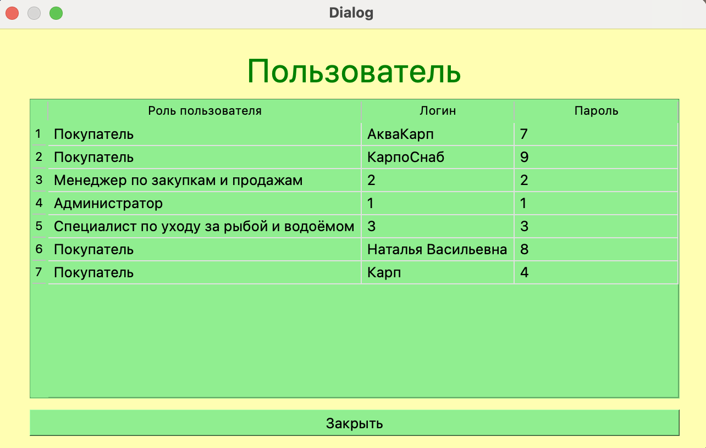

# Приложение для работы с АИС "Карповое хозяйство"

Приложение разработано на языке C++ с использованием фреймворка Qt. В качестве СУБД используется PostgreSQL.

## Содержание

1. [Авторизация и регистрация](#1-авторизация-и-регистрация)  
2. [Пользовательский интерфейс](#2-пользовательский-интерфейс)  
3. [Интерфейсы сотрудников](#3-интерфейсы-сотрудников)  
4. [Работа с данными](#4-работа-с-данными)  
5. [Отчеты](#5-отчеты)  

---

## 1. Авторизация и регистрация

**Авторизация** — форма входа в систему для пользователей и сотрудников.  
**Регистрация** — создание новой учетной записи с указанием личных данных.  
**Информация о разработчике** — модальное окно с описанием системы.

  
  

---

## 2. Пользовательский интерфейс

Интерфейс пользователя включает:

- Просмотр информации о прудах и карпах в них.
- Получение отчетов.

---

## 3. Интерфейсы сотрудников

### Специалист по уходу за рыбой и водоёмом:

- Работа с таблицами **Карп**, **Пруд**, **Карп в пруду**, **Кормление**.
- Возможность формировать отчеты по каждой сущности.

### Менеджер по закупкам и продажам:

- Работа с **контрагентами**, **покупками**, **продажами**, **номенклатурой**.
- Доступ к отчетам по сделкам и культтивации.

### Администратор:

- Управление пользователями и настройками системы.
- Доступ ко всем сущностям системы, включая группы сотрудников.

---

## 4. Работа с данными

Система включает формы для работы со следующими таблицами:

- **Пруд**: добавление, редактирование, удаление, поиск.  
  

- **Карп**: просмотр и редактирование, указание местоположения.  
  

- **Карп в пруду**: сопоставление карпов с прудами, отчеты по видам.  
  

- **Кормление**: история и планирование кормления.  
  

- **Номенклатура**: управление ресурсами (корма, снаряжение и др.).  
  

- **Контрагент**: учет клиентов и партнеров.  
  

- **Покупка / Продажа**: сделки с контрагентами.  
    
  

- **Сотрудник и группа сотрудников**: управление кадрами.  
    
  

---

## 5. Отчеты

Система предоставляет возможность формирования отчетов:

- О **прудах**, **карпах**, **карпах в пруду**, **кормлениях**.
- О **пользователях**, **сотрудниках**, **группах сотрудников**.
- О **контрагентах**, **покупках**, **продажах**, **номенклатуре**.

Примеры:

- 
- 
- 
- 
- 
- 
- 
- 
- 
- 
- 
- 
- (images/image051.png)
- (images/image052.png)
- (images/image053.png)
- (images/image054.png)
